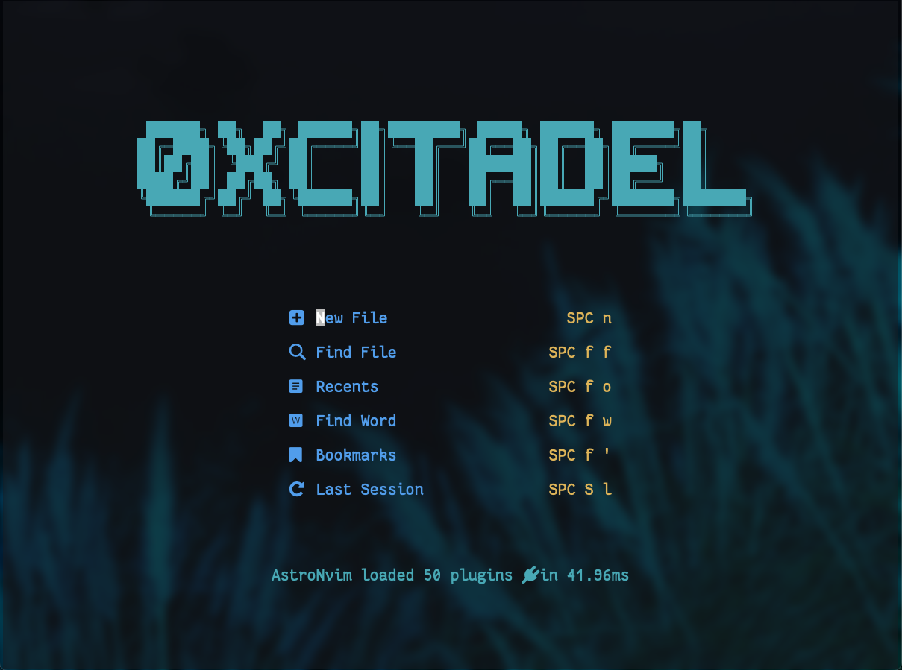

## Astro user profile for  Neovim

>  🕹 Modified base profile that can be used as a reference



### 🛠️ How to install?

------------


#### Linux or MacOS (Unix)

##### Make a backup of your current user
```shell
mv ~/.config/nvim/lua/user ~/.config/nvim/lua/user.bak
```

##### Clone the repository
```shell
git clone --depth 1 https://github.com/0xCitaDel/astrovim-user.git $env:LOCALAPPDATA\nvim\lua\user
```
